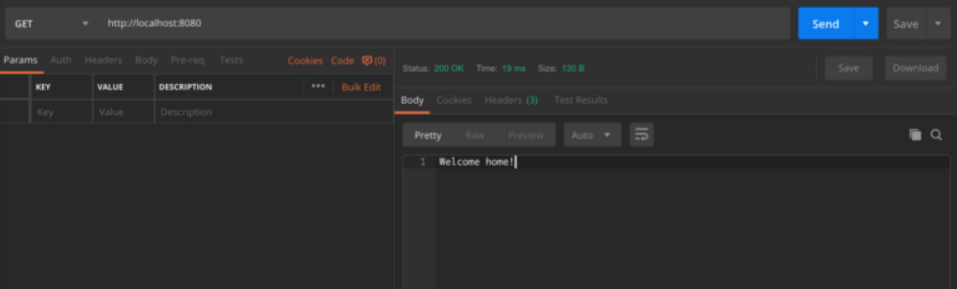
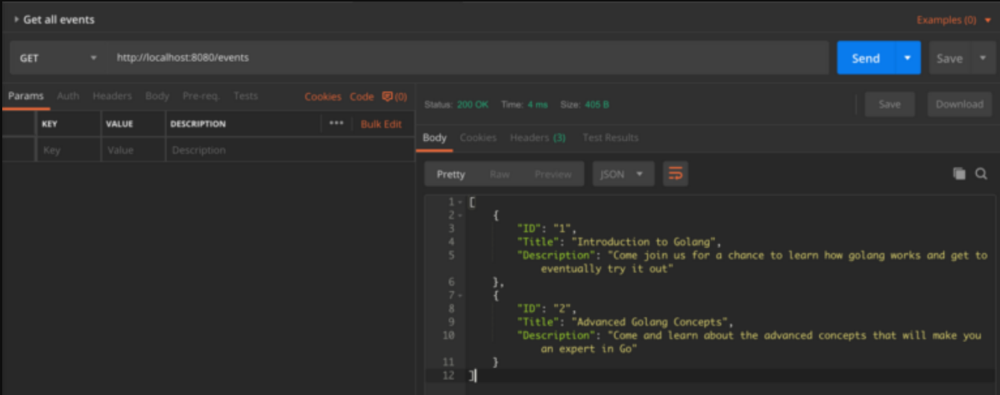
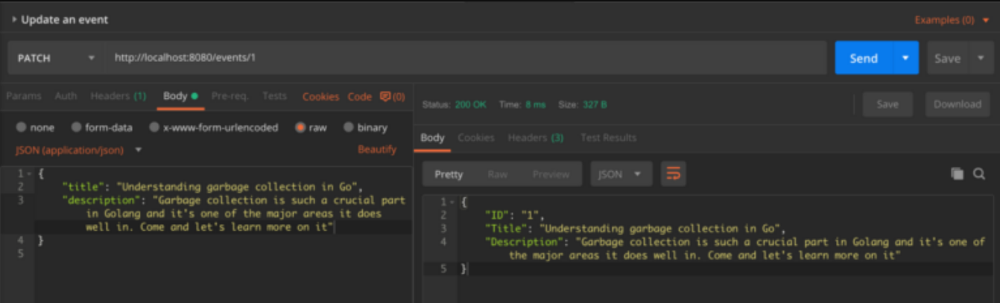
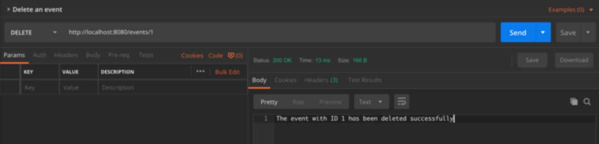

# Create Rest Apis with Go - Begginers

#### This quick start guide will take you through creating Rest Apis using Go.


**Requirements:** We assume you are familiar with Go and the software already installed on your system. If you did not install it OR need a quick reference I prepared a cheat-sheet. Please find toturial from [Here](https://github.com/hakimehmordadi/Go-Cheat-Sheet/blob/main/BashScrip.sh/).


## Lets get dig into the codes 🚀

The first step to building the app is creating the structure now it’s time to get down to it. Organize your file and folders like below picture.

<p align="center"></p>

Understanding how to work with files and folders is important. See details below 


* <code>assets/, </code> Contains image and other asset files to be copied as-is when you build your application. favicon.
* <code>go.mod</code> Module is go support for dependency management. A module by definition is a collection of related packages with go.mod at its root. The go.mod file defines the:
    * Module import path.
    * The version of go with which the module is created
    * Dependency requirements of the module for a successful build. It defines both project’s dependencies requirement and also locks them to their correct version.
<blockquote>
<code>  Module vs Package? </code> <p> A package is a directory of .go files, and it is the basic building block of a Go program. Packages help to organize code into reusable components. On the other side, a module is a collection of packages with built-in dependencies and versioning. A module comes with two additional files go.</p>
</blockquote>
<blockquote>
<code>  go.mod vs go.sum? </code> <p> In the go.mod file there is a complete list of project dependencies and also in the go.sum file it stores a hash of each package to remember the version of the installed package.</p>
</blockquote>

*   <code>README.md</code> Contains all required description that you provide for users.
*   <code>app.go</code> The main file that includes all code for this sample project.

## Set up a HTTP Server using Gorilla Mux

[Gorilla Mux](https://github.com/gorilla/mux) is a package that allows you to create the routes required by the application and refer each of the incoming requests to the corresponding controller. Before working with the Mux package, it must be installed as follows:

```go
go mod init
go get -u github.com/gorilla/mux
```
The next step would be defining the first api of the program.

```go
package main

import (
	"fmt"
	"log"
	"net/http"

	"github.com/gorilla/mux"
)

func homeLink(w http.ResponseWriter, r *http.Request) {
	fmt.Fprintf(w, "Welcome home!")
}

func main() {
	router := mux.NewRouter().StrictSlash(true)
	router.HandleFunc("/", homeLink)
	log.Fatal(http.ListenAndServe(":8080", router))
}
```
For sure, after making any changes in the codes, we need to run the program again. Now, there are two solutions, the first one is compiling the program and running the compiled program, but to speed up the process of testing the program, you can run the <code>go run main.go</code> command, which will run the developed server without the need for compilation.

The expected output after launching and sending a <code>GET</code> request to the application at <code>localhost:8080</code> is as follows.

<p align="center"></p>

## Database simulation
To simulate the database, we can define events in the program as follows:

```go
type event struct {
	ID          string `json:"ID"`
	Title       string `json:"Title"`
	Description string `json:"Description"`
}

type allEvents []event

var events = allEvents{
	{
		ID:          "1",
		Title:       "Introduction to Golang",
		Description: "Come join us for a chance to learn how golang works and get to eventually try it out",
	},
}
```

In this structure, we have only <code>used ID</code>, <code>Title</code> and <code>Description</code> to store events, and in the following we will implement the codes related to adding, updating and deleting events.

## Add a new event
To create a new event, we need to receive the <code>POST</code> data and add it to the simulated database. In the next step, after the event is successfully added to the simulated database, we return the same event to the user with the status code number <code>201</code>:

```go
package main

import (
	"encoding/json"
	"fmt"
	"io/ioutil"
	"log"
	"net/http"

	"github.com/gorilla/mux"
)

type event struct {
	ID          string `json:"ID"`
	Title       string `json:"Title"`
	Description string `json:"Description"`
}

type allEvents []event

var events = allEvents{
	{
		ID:          "1",
		Title:       "Introduction to Golang",
		Description: "Come join us for a chance to learn how golang works and get to eventually try it out",
	},
}

func createEvent(w http.ResponseWriter, r *http.Request) {
	var newEvent event
	// Convert r.Body into a readable formart
	reqBody, err := ioutil.ReadAll(r.Body)
	if err != nil {
		fmt.Fprintf(w, "Kindly enter data with the event id, title and description only in order to update")
	}

	json.Unmarshal(reqBody, &newEvent)

	// Add the newly created event to the array of events
	events = append(events, newEvent)

	// Return the 201 created status code
	w.WriteHeader(http.StatusCreated)
	// Return the newly created event
	json.NewEncoder(w).Encode(newEvent)
}

func homeLink(w http.ResponseWriter, r *http.Request) {
	fmt.Fprintf(w, "Welcome home!")
}

func main() {
	router := mux.NewRouter().StrictSlash(true)
	router.HandleFunc("/", homeLink)
	router.HandleFunc("/event", createEvent).Methods("POST")
	log.Fatal(http.ListenAndServe(":8080", router))
}
```
<p align="center"></p>

## Show all events
To display all events, we must display the events data:

```go
package main

import (
	"encoding/json"
	"fmt"
	"io/ioutil"
	"log"
	"net/http"

	"github.com/gorilla/mux"
)

type event struct {
	ID          string `json:"ID"`
	Title       string `json:"Title"`
	Description string `json:"Description"`
}

type allEvents []event

var events = allEvents{
	{
		ID:          "1",
		Title:       "Introduction to Golang",
		Description: "Come join us for a chance to learn how golang works and get to eventually try it out",
	},
}

func homeLink(w http.ResponseWriter, r *http.Request) {
	fmt.Fprintf(w, "Welcome home!")
}

func createEvent(w http.ResponseWriter, r *http.Request) {
	var newEvent event
	// Convert r.Body into a readable formart
	reqBody, err := ioutil.ReadAll(r.Body)
	if err != nil {
		fmt.Fprintf(w, "Kindly enter data with the event id, title and description only in order to update")
	}

	json.Unmarshal(reqBody, &newEvent)

	// Add the newly created event to the array of events
	events = append(events, newEvent)

	// Return the 201 created status code
	w.WriteHeader(http.StatusCreated)
	// Return the newly created event
	json.NewEncoder(w).Encode(newEvent)
}

func getAllEvents(w http.ResponseWriter, r *http.Request) {
	json.NewEncoder(w).Encode(events)
}

func main() {
	router := mux.NewRouter().StrictSlash(true)
	router.HandleFunc("/", homeLink)
	router.HandleFunc("/event", createEvent).Methods("POST")
	router.HandleFunc("/events", getAllEvents).Methods("GET")
	log.Fatal(http.ListenAndServe(":8080", router))
}
```
<p align="center"></p>


## Show a special event
To display a specific event, we need to get the <code>ID</code> value with the help of Mux and finally, if the sent <code>ID</code> matches the events in the simulated database, display all the data of that event:

```go
package main

import (
	"encoding/json"
	"fmt"
	"io/ioutil"
	"log"
	"net/http"

	"github.com/gorilla/mux"
)

type event struct {
	ID          string `json:"ID"`
	Title       string `json:"Title"`
	Description string `json:"Description"`
}

type allEvents []event

var events = allEvents{
	{
		ID:          "1",
		Title:       "Introduction to Golang",
		Description: "Come join us for a chance to learn how golang works and get to eventually try it out",
	},
}

func homeLink(w http.ResponseWriter, r *http.Request) {
	fmt.Fprintf(w, "Welcome home!")
}

func createEvent(w http.ResponseWriter, r *http.Request) {
	var newEvent event
	// Convert r.Body into a readable formart
	reqBody, err := ioutil.ReadAll(r.Body)
	if err != nil {
		fmt.Fprintf(w, "Kindly enter data with the event id, title and description only in order to update")
	}

	json.Unmarshal(reqBody, &newEvent)

	// Add the newly created event to the array of events
	events = append(events, newEvent)

	// Return the 201 created status code
	w.WriteHeader(http.StatusCreated)
	// Return the newly created event
	json.NewEncoder(w).Encode(newEvent)
}

func getOneEvent(w http.ResponseWriter, r *http.Request) {
	// Get the ID from the url
	eventID := mux.Vars(r)["id"]

	// Get the details from an existing event
	// Use the blank identifier to avoid creating a value that will not be used
	for _, singleEvent := range events {
		if singleEvent.ID == eventID {
			json.NewEncoder(w).Encode(singleEvent)
		}
	}
}

func getAllEvents(w http.ResponseWriter, r *http.Request) {
	json.NewEncoder(w).Encode(events)
}

func main() {
	router := mux.NewRouter().StrictSlash(true)
	router.HandleFunc("/", homeLink)
	router.HandleFunc("/event", createEvent).Methods("POST")
	router.HandleFunc("/events", getAllEvents).Methods("GET")
	router.HandleFunc("/events/{id}", getOneEvent).Methods("GET")
	log.Fatal(http.ListenAndServe(":8080", router))
}
```
<p align="center"></p>


## Update an event
To update an event, we will act exactly like the previous section and we will use Mux to get the <code>ID</code>. If there is an event with this <code>ID</code>, we go through the values passed in the body of the <code>PATCH</code> request and replace them with the current event values. Finally, we display the updated event:

```go
package main

import (
	"encoding/json"
	"fmt"
	"io/ioutil"
	"log"
	"net/http"

	"github.com/gorilla/mux"
)

type event struct {
	ID          string `json:"ID"`
	Title       string `json:"Title"`
	Description string `json:"Description"`
}

type allEvents []event

var events = allEvents{
	{
		ID:          "1",
		Title:       "Introduction to Golang",
		Description: "Come join us for a chance to learn how golang works and get to eventually try it out",
	},
}

func homeLink(w http.ResponseWriter, r *http.Request) {
	fmt.Fprintf(w, "Welcome home!")
}

func createEvent(w http.ResponseWriter, r *http.Request) {
	var newEvent event
	// Convert r.Body into a readable formart
	reqBody, err := ioutil.ReadAll(r.Body)
	if err != nil {
		fmt.Fprintf(w, "Kindly enter data with the event id, title and description only in order to update")
	}

	json.Unmarshal(reqBody, &newEvent)

	// Add the newly created event to the array of events
	events = append(events, newEvent)

	// Return the 201 created status code
	w.WriteHeader(http.StatusCreated)
	// Return the newly created event
	json.NewEncoder(w).Encode(newEvent)
}

func getOneEvent(w http.ResponseWriter, r *http.Request) {
	// Get the ID from the url
	eventID := mux.Vars(r)["id"]

	// Get the details from an existing event
	// Use the blank identifier to avoid creating a value that will not be used
	for _, singleEvent := range events {
		if singleEvent.ID == eventID {
			json.NewEncoder(w).Encode(singleEvent)
		}
	}
}

func getAllEvents(w http.ResponseWriter, r *http.Request) {
	json.NewEncoder(w).Encode(events)
}

func updateEvent(w http.ResponseWriter, r *http.Request) {
	// Get the ID from the url
	eventID := mux.Vars(r)["id"]
	var updatedEvent event
	// Convert r.Body into a readable formart
	reqBody, err := ioutil.ReadAll(r.Body)
	if err != nil {
		fmt.Fprintf(w, "Kindly enter data with the event title and description only in order to update")
	}

	json.Unmarshal(reqBody, &updatedEvent)

	for i, singleEvent := range events {
		if singleEvent.ID == eventID {
			singleEvent.Title = updatedEvent.Title
			singleEvent.Description = updatedEvent.Description
			events[i] = singleEvent
			json.NewEncoder(w).Encode(singleEvent)
		}
	}
}

func main() {
	router := mux.NewRouter().StrictSlash(true)
	router.HandleFunc("/", homeLink)
	router.HandleFunc("/event", createEvent).Methods("POST")
	router.HandleFunc("/events", getAllEvents).Methods("GET")
	router.HandleFunc("/events/{id}", getOneEvent).Methods("GET")
	router.HandleFunc("/events/{id}", updateEvent).Methods("PATCH")
	log.Fatal(http.ListenAndServe(":8080", router))
}
```
<p align="center"></p>

## Delete an event
Deleting an event is done with the <code>DELETE</code> method, so we will get the ID value sent in DELETE method requests with the help of Mux and compare it with the simulated database. If there is an event with this <code>ID</code> in our database, we will delete it and finally display the successful deletion of the event:

```go
package main

import (
	"encoding/json"
	"fmt"
	"io/ioutil"
	"log"
	"net/http"

	"github.com/gorilla/mux"
)

type event struct {
	ID          string `json:"ID"`
	Title       string `json:"Title"`
	Description string `json:"Description"`
}

type allEvents []event

var events = allEvents{
	{
		ID:          "1",
		Title:       "Introduction to Golang",
		Description: "Come join us for a chance to learn how golang works and get to eventually try it out",
	},
}

func homeLink(w http.ResponseWriter, r *http.Request) {
	fmt.Fprintf(w, "Welcome home!")
}

func createEvent(w http.ResponseWriter, r *http.Request) {
	var newEvent event
	// Convert r.Body into a readable formart
	reqBody, err := ioutil.ReadAll(r.Body)
	if err != nil {
		fmt.Fprintf(w, "Kindly enter data with the event id, title and description only in order to update")
	}

	json.Unmarshal(reqBody, &newEvent)

	// Add the newly created event to the array of events
	events = append(events, newEvent)

	// Return the 201 created status code
	w.WriteHeader(http.StatusCreated)
	// Return the newly created event
	json.NewEncoder(w).Encode(newEvent)
}

func getOneEvent(w http.ResponseWriter, r *http.Request) {
	// Get the ID from the url
	eventID := mux.Vars(r)["id"]

	// Get the details from an existing event
	// Use the blank identifier to avoid creating a value that will not be used
	for _, singleEvent := range events {
		if singleEvent.ID == eventID {
			json.NewEncoder(w).Encode(singleEvent)
		}
	}
}

func getAllEvents(w http.ResponseWriter, r *http.Request) {
	json.NewEncoder(w).Encode(events)
}

func updateEvent(w http.ResponseWriter, r *http.Request) {
	// Get the ID from the url
	eventID := mux.Vars(r)["id"]
	var updatedEvent event
	// Convert r.Body into a readable formart
	reqBody, err := ioutil.ReadAll(r.Body)
	if err != nil {
		fmt.Fprintf(w, "Kindly enter data with the event title and description only in order to update")
	}

	json.Unmarshal(reqBody, &updatedEvent)

	for i, singleEvent := range events {
		if singleEvent.ID == eventID {
			singleEvent.Title = updatedEvent.Title
			singleEvent.Description = updatedEvent.Description
			events[i] = singleEvent
			json.NewEncoder(w).Encode(singleEvent)
		}
	}
}

func deleteEvent(w http.ResponseWriter, r *http.Request) {
	// Get the ID from the url
	eventID := mux.Vars(r)["id"]

	// Get the details from an existing event
	// Use the blank identifier to avoid creating a value that will not be used
	for i, singleEvent := range events {
		if singleEvent.ID == eventID {
			events = append(events[:i], events[i+1:]...)
			fmt.Fprintf(w, "The event with ID %v has been deleted successfully", eventID)
		}
	}
}

func main() {
	router := mux.NewRouter().StrictSlash(true)
	router.HandleFunc("/", homeLink)
	router.HandleFunc("/event", createEvent).Methods("POST")
	router.HandleFunc("/events", getAllEvents).Methods("GET")
	router.HandleFunc("/events/{id}", getOneEvent).Methods("GET")
	router.HandleFunc("/events/{id}", updateEvent).Methods("PATCH")
	router.HandleFunc("/events/{id}", deleteEvent).Methods("DELETE")
	log.Fatal(http.ListenAndServe(":8080", router))
}
```
<p align="center"></p>


<p align="center"></p>


