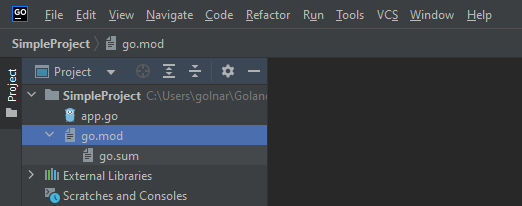

# Go-RestAPI-Bigginers

#### This quick start guide will take you through creating Rest Apis using Go.

<blockquote>

Requirements: We assume you are familiar with Go and the software already installed on your system. If you did not install it OR need a quick reference I prepared a cheat-sheet. Please find toturial from https://github.com/hakimehmordadi/Go-Cheat-Sheet/blob/main/BashScrip.sh.

</blockquote>

# Lets get dig into the codes 🚀

The first step to building the app is creating the structure now it’s time to get down to it. Organize your file and folders like below picture.

Understanding how to work with files and folders is important. See details below 

* <code>assets/, </code> Contains image and other asset files to be copied as-is when you build your application. favicon.
* <code>go.mod</code> Module is go support for dependency management. A module by definition is a collection of related packages with go.mod at its root. The go.mod file defines the:
    * Module import path.
    * The version of go with which the module is created
    * Dependency requirements of the module for a successful build. It defines both project’s dependencies requirement and also locks them to their correct version.
<blockquote>
<code>  Module vs Package? </code> 
 A package is a directory of .go files, and it is the basic building block of a Go program. Packages help to organize code into reusable components. On the other side, a module is a collection of packages with built-in dependencies and versioning. A module comes with two additional files go.

</blockquote>
<blockquote>
<code>  go.mod vs go.sum? </code> 
 In the go.mod file there is a complete list of project dependencies and also in the go.sum file it stores a hash of each package to remember the version of the installed package.

</blockquote>

*   <code>README.md</code> Contains all required description that you provide for users.
*   <code>app.go</code> The main file that includes all code for this sample project.

